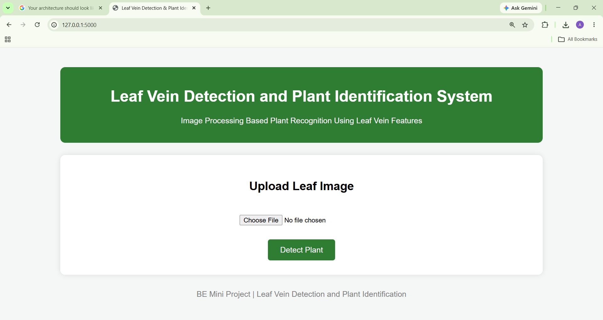

🌿 Leaf Vein Extraction and Plant Identification

A Machine Learning and Computer Vision based web application that extracts leaf vein patterns from plant leaves and identifies the plant species using image processing techniques and trained machine learning models.


📖 Project Overview

Leaf identification plays an important role in agriculture, forestry, medicinal plant research, and biodiversity conservation. Traditional identification methods require botanical expertise and are time-consuming.

This project automates the identification process by extracting vein structures from leaf images and classifying them using machine learning algorithms.

The application is built using **Python**, **Flask**, **OpenCV**, and **Scikit-learn**.


## ✨ Features

- 🍃 Upload leaf images through a web interface
- 🖼️ Automatic image preprocessing
- 🎨 CLAHE image enhancement
- 🌿 Top-Hat transformation
- ⚫ Adaptive Thresholding
- 🔍 Morphological filtering
- 🧬 Leaf vein extraction
- 📊 Feature extraction
- 🤖 Machine Learning based plant classification
- 📈 Random Forest and SVM model training
- 🌐 Simple and responsive Flask web application
- 📸 Step-by-step visualization of image processing stages


🧠 How It Works

The application follows the complete image processing pipeline:

1. User uploads a leaf image.
2. Image is resized and preprocessed.
3. CLAHE improves image contrast.
4. Top-Hat transformation highlights thin vein structures.
5. Adaptive Thresholding segments the veins.
6. Morphological operations remove noise.
7. Final vein structure is extracted.
8. Texture and shape features are extracted.
9. The trained Machine Learning model predicts the plant species.
10. The predicted class along with processed images is displayed on the web page.

 🖼️ Image Processing Pipeline

Input Leaf Image
        │
        ▼
Grayscale Conversion
        │
        ▼
CLAHE Enhancement
        │
        ▼
Top-Hat Transformation
        │
        ▼
Adaptive Thresholding
        │
        ▼
Morphological Operations
        │
        ▼
Vein Extraction
        │
        ▼
Feature Extraction
        │
        ▼
Machine Learning Model
        │
        ▼
Plant Identification
'''
 🛠 Technology Stack

 Programming Language

- Python

Backend

- Flask

 Frontend

- HTML
- CSS
 Image Processing

- OpenCV
- NumPy

Machine Learning

- Scikit-learn
- Random Forest
- Support Vector Machine (SVM)

Data Handling

- Pandas

Model Storage

- Pickle (.pkl)

---

📂 Dataset

This project uses the **Flavia Leaf Dataset**, which contains images of various plant species.

The dataset is used to train machine learning models based on extracted leaf vein features.

---
 📊 Machine Learning Models

The project includes:

- Random Forest Classifier
- Support Vector Machine (SVM)

The trained models are stored inside the `models/` directory.

---

📈 Image Processing Techniques

The project uses the following techniques:

- Grayscale Conversion
- CLAHE (Contrast Limited Adaptive Histogram Equalization)
- Top-Hat Transformation
- Adaptive Thresholding
- Morphological Opening
- Morphological Closing
- Vein Enhancement
- Feature Extraction

---

📸 Screenshots

 Home Page



---

Upload Leaf Image


---

Image Processing Steps


---

Vein Extraction


---

Plant Prediction


---

Final Result


---

⚙️ Installation Guide

Clone the repository

```bash
git clone https://github.com/Ananya27290/leaf-vein-extraction-plant-identification.git
```

---

 Move into the project directory

```bash
cd leaf-vein-extraction-plant-identification
```

---

Create a virtual environment

```bash
python -m venv venv
```

---

 Activate the virtual environment

Windows

```bash
venv\Scripts\activate
```

Linux / macOS

```bash
source venv/bin/activate
```

---

Install dependencies

```bash
pip install -r requirements.txt
```

---

 Run the application

```bash
python app.py
```

or

```bash
python main.py
```

---

Open in Browser

```
http://127.0.0.1:5000
```

---

📁 Output

The application displays:

- Uploaded image
- CLAHE output
- Top-Hat output
- Adaptive Threshold output
- Morphological output
- Final vein extraction
- Predicted plant species

---

🚀 Future Enhancements

- 🌿 Deep Learning based classification using CNN
- ☁️ Cloud deployment
- 📱 Mobile application
- 🌍 Multi-language support
- 📷 Real-time camera-based leaf detection
- 🤖 AI-powered disease detection
- 📊 Higher accuracy using larger datasets
- 🔍 Explainable AI (XAI) for prediction visualization

---
👩‍💻 Author

Ananya S

GitHub:
https://github.com/Ananya27290

---

⭐ If you found this project helpful, consider giving it a Star.
